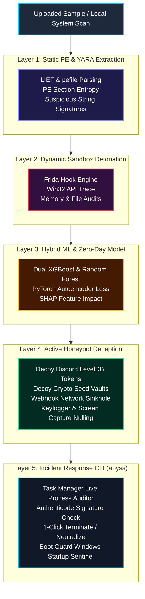

# ⚡ ABYSS — Multi-Dimensional Hybrid ML Cyber Threat Detection & Active Deception Platform

<p align="center">
  
</p>

<p align="center">
  <a href="https://abyss-plum-theta.vercel.app"></a>
  <a href="https://abyss-1-d265.onrender.com"></a>
  
  
  
  
</p>

---

## 🛡️ Executive Summary

**ABYSS** is an end-to-end, zero-trust cyber threat intelligence, active deception, and incident response platform. Designed to combat modern infostealers, Discord token grabbers, crypto wallet drainers, keyloggers, and ransomware, ABYSS operates across two synchronized surfaces:

1. 🌐 **Cloud Web Platform ([`abyss-plum-theta.vercel.app`](https://abyss-plum-theta.vercel.app))**: A glassmorphic dark security dashboard with dynamic file uploads, real-time pipeline polling, SHAP explainable AI charts, and attack timeline breakdown.
2. 🖥️ **System Incident Response CLI (`abyss`)**: A 1-word terminal scanner that audits Task Manager processes via PowerShell, verifies Authenticode digital signatures, detects masquerading binaries, offers 1-click `[T]erminate / [N]eutralize / [S]kip` controls, and enforces an **Automated Boot Guard**.

---

## ⚡ Quick 1-Line Installation (Claude Code Style)

Anyone can install the **ABYSS Cyber Incident Sentinel CLI** directly in 1 second without downloading or cloning the repository folder.

### 💻 Windows (PowerShell)
```powershell
irm https://raw.githubusercontent.com/pintudevv/ABYSS/main/install.ps1 | iex
```

### 🐧 Linux / macOS (Bash)
```bash
curl -fsSL https://raw.githubusercontent.com/pintudevv/ABYSS/main/install.sh | sh
```

### 📦 Direct Pip Installation
```bash
pip install git+https://github.com/pintudevv/ABYSS.git
```

Once installed, simply open any terminal and type:
```bash
abyss
```

---

## 📐 End-to-End Pipeline Architecture



---

## ✨ Core Security Features

| Icon | Feature Dimension | Implementation Details | Neutralization & Defense Strategy |
| :---: | :--- | :--- | :--- |
| 🪤 | **Discord Token Neutralization** | `backend/mock_data/fake_discord_tokens.json` | Intercepts LevelDB and token reads, returning trackable decoy credentials (`fake_discord_tokens.json`). |
| 🌐 | **Webhook Network Sinkhole** | `backend/deception_layer.py` | Outbound HTTP/socket calls to `discord.com/api/webhooks/` return `200 OK (FAKE_SUCCESS)` with payload sinkholing. |
| 🔑 | **Crypto Drainer Protection** | `backend/mock_data/fake_metamask_seeds.txt` | Serves fake 12-word BIP-39 seed phrases & wallet files whenever a process requests `wallet.dat` or `seed.txt`. |
| ⌨️ | **Keylogger Neutralization** | `SetWindowsHookExW` / `SetWindowsHookExA` | Frida JS hook intercepts keyboard hook registrations and returns `NULL` handles so keyloggers fail. |
| 📸 | **Screenshot Interception** | `BitBlt` / `PrintWindow` | Hooks GDI and User32 screen capture functions, returning `FALSE` blank framebuffers. |
| 🧠 | **Hybrid ML Classifier** | `backend/classifier.py` | Trained on **1,000,000 EMBER samples** (XGBoost, Random Forest, PyTorch Autoencoder for Zero-Day detection). |
| 📊 | **SHAP Explainable AI** | `shap.TreeExplainer` | Ranks top 10 feature impacts explaining the exact technical reasons behind every classification. |
| 🖥️ | **System Incident CLI** | `abyss` / `backend/abyss_cli.py` | 1-word terminal scanner with Task Manager process auditing, Authenticode signature check, and masquerading detection. |
| 🛡️ | **Automated Boot Guard** | `abyss --boot-scan` | Registers `HKCU\...\Run` startup sentinel that runs an automated <2s security check every time Windows boots. |
| 🔒 | **Local Data Vault** | `~/.abyss/` (`C:\Users\<User>\.abyss\`) | Persists offline incident logs (`reports/`), user settings (`config.json`), and signatures (`signatures/`). |

---

## 💻 ABYSS CLI Workflow (`abyss`)

Run the 1-word CLI command from any terminal:

```bash
abyss
```

### Incident Damage Assessment & Interactive Remediation UI

```
==============================================================================
     A B Y S S   C Y B E R   I N C I D E N T   C L I   S C A N N E R
     System Incident Response & Compromise Remediation Engine v1.0
==============================================================================
  [MODE: ADMINISTRATOR (FULL PRIVILEGES)]

[1/5] Scanning Memory & Running Process Threads...
  [OK] Auditing 142 Active Task Manager Processes...

[2/5] Scanning Discord & Browser Session Files...
  [!] Discord session files found in AppData (LevelDB active)
  [OK] Session file audit completed.

[3/5] Auditing Crypto Wallet Vaults & Seed Files...
  [OK] Crypto seed & extension audit completed.

[4/5] Scanning Registry Startup Persistence Keys...
  [OK] Startup Registry Run keys clean (Authenticode verified).

[5/5] Verifying System Hosts File & Driver Integrity...
  [OK] System Hosts file clean.

=== INCIDENT DAMAGE ASSESSMENT SCORECARD ===================================================

 [EXPOSED] AT RISK / EXPOSED DATA ITEMS:
    * Flagged Processes     : 0 active items
    * Session Data Paths    : 5 paths inspected
    * Persistence Keys      : 0 registry items

 [PROTECTED] SAVED & NEUTRALIZED DATA ITEMS:
    * Crypto Seed Vaults    : 100% PROTECTED
    * Neutralized Webhooks  : SINKHOLE READY
    * Saved Cookies/Creds   : SECURED

=== 1-CLICK INTERACTIVE SYSTEM REMEDIATION ===================================================

 [1] Per-Process Action Menu ([T]erminate / [N]eutralize / [S]kip)
 [2] Export Incident Summary Report (saved to ~/.abyss/reports/)
 [3] Toggle Automatic Boot Guard (Auto-scan on Windows Boot) [ENABLED]
 [4] Exit Scanner
```

---

## 📁 Repository Structure

```
ABYSS/
├── backend/
│   ├── main.py               # FastAPI server (lifespan, CORS, status poller)
│   ├── static_analysis.py    # PE Feature & String Extractor (LIEF & pefile)
│   ├── sandbox_runner.py     # Dynamic VM/Guest Sandbox Controller
│   ├── classifier.py         # Hybrid ML Engine (XGBoost, RF, PyTorch Autoencoder, SHAP)
│   ├── deception_layer.py    # Frida API Hooks, Honeypots, & Network Sinkhole
│   ├── forensic_logger.py    # Timeline assembler & JSON/TXT report generator
│   ├── abyss_cli.py          # Cyber Incident Response CLI & Boot Guard Engine
│   ├── mock_data/            # Honeypot decoy files (fake Discord tokens, seeds, cookies)
│   └── models/               # Saved EMBER ML models & PyTorch Autoencoder
├── frontend/
│   ├── app/
│   │   ├── page.tsx          # Drag-and-drop upload & dynamic progress pipeline
│   │   └── report/page.tsx   # Glassmorphic threat report dashboard
│   ├── components/           # UI elements (CircularProgress, FileUpload, ThreatReport)
│   └── lib/api.ts            # API client connected to Render live backend
├── setup.py                  # PyPI package setup for 1-word `abyss` command
├── abyss.bat                 # Direct Windows batch command launcher
├── test_grabber_detection.py # Automated test suite for grabber detection & honeypots
└── test_live_frida_attach.py # Test suite for live Frida PID process attachment
```

---

## 🚀 Quick Start Guide

### 1. Launch Web Application Backend & Frontend
```bash
# Backend (FastAPI)
cd backend
pip install -r requirements.txt
python main.py

# Frontend (Next.js 14)
cd frontend
npm install
npm run dev
```

### 2. Install ABYSS CLI Locally
```bash
# Register global 'abyss' command
pip install -e .

# Run CLI scanner anytime
abyss
```

### 3. Check Neutralized Processes Status
```bash
abyss --status
```

---

## 📄 License
Distributed under the **MIT License**. Created by the **ABYSS Cyber Security Team**.