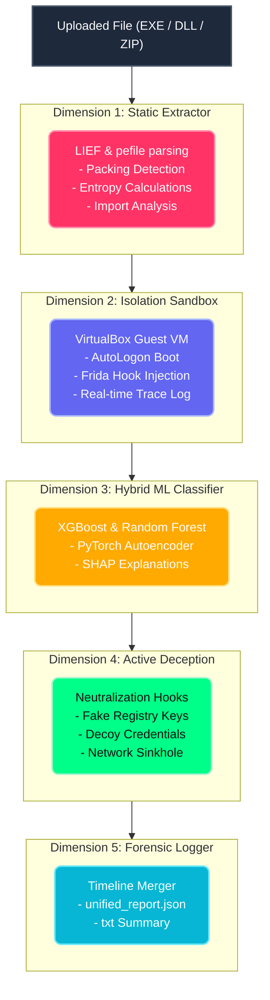

# ABYSS
### **Multi-Dimensional Hybrid ML Malware Detection & Active Deception Sandbox**

```
     ___       ______   ____    ____  _______.   _______.
    /   \     |   _  \  \   \  /   / /       |  /       |
   /  ^  \    |  |_)  |  \   \/   / |   (----` |   (----`
  /  /_\  \   |   _  <    \_    _/   \   \      \   \    
 /  _____  \  |  |_)  |     |  | .----)   | .----)   |   
/__/     \__\ |______/      |__| |_______/  |_______/    
```
<p align="left">
  
  
  
  
  
  
</p>

---

## Pipeline Architecture

The ABYSS engine processes untrusted files through a **5-Layer Security Stack**. Each layer acts as a separate dimension of analysis and mitigation:


<p align="left">
  
  
  
  
  
  
</p>

---

## 5-Layer Stack Anatomy

| Dimension | Engine Component | Target Indicators | Active Mitigation / Neutralization |
| :--- | :--- | :--- | :--- |
| **1. Static Analysis** | `static_analysis.py` | UPX/Packed headers, high entropy sections, suspicious strings. | Early threat grading (Risk Score 0-100). If score $\ge 95$, skips sandbox stage to protect VM resources. |
| **2. Dynamic Profiling** | `sandbox_runner.py` | Runtime APIs (`VirtualAllocEx`, `WriteProcessMemory`, registry keys). | Automated headless rollback to `clean-baseline` snapshot, executing sample under Frida hooks. |
| **3. Machine Learning** | `classifier.py` | 2,381-feature EMBER static array, reconstruction loss anomalies. | Dual XGBoost/RF threat classification. Autoencoder captures zero-day variance. SHAP renders impact chart. |
| **4. Active Deception** | `deception_layer.py` | Credential stealing, clipboard sniffers, C2 connection relays. | Frida hooks return `FAKE_SUCCESS`, intercepting `CreateFile` / `GetClipboardData`. Sockets are exfil-sinkholed. |
| **5. Forensics** | `forensic_logger.py` | Scattered system logs, API traces, honeypot access logs. | Reconstructs a chronological attack timeline with graded severity tags (Critical, High, Medium, Low). |

---

## Repository Structure

```
abyss/
├── backend/
│   ├── main.py              # FastAPI server (lifespan, CORS, status pollers)
│   ├── static_analysis.py   # Stage 1: PE feature and string extractor (LIEF/pefile)
│   ├── sandbox_runner.py    # Stage 2: VM controller, AutoLogon, guest runner
│   ├── guest_sandbox.py     # Guest side: Frida export injection engine (x86/x64)
│   ├── classifier.py        # Stage 3: ML Engine (XGBoost, RF, PyTorch Autoencoder, SHAP)
│   ├── deception_layer.py   # Stage 4: Frida faking, Network Sinkholing, watchdog decoys
│   ├── forensic_logger.py   # Stage 5: Timeline assembler & JSON/TXT report builder
│   ├── models/              # Saved ML models (xgboost_model.pkl, rf_model.pkl, autoencoder.pt)
│   ├── mock_data/           # Honeypot decoy files (cookies, credit cards, passwords)
│   └── results/             # Analysis outputs (features.json, behavior.json, results.json)
├── frontend/
│   ├── app/
│   │   ├── page.tsx         # Drag-and-drop file upload & dynamic progress pipeline
│   │   └── report/page.tsx  # Interactive glassmorphism threat intelligence dashboard
│   ├── components/          # UI elements (CircularProgress, FileUpload, ThreatReport)
│   └── lib/api.ts           # API client (maps real backend response to UI structure)
└── training/
    ├── train_model.ipynb    # Google Colab notebook for ML classifier training
    ├── test_real_behavior.c # Safe custom binary showcasing hooked API actions
    └── test_suspicious.c    # Safe custom binary showcasing dynamic API resolution
```
<p align="left">
  
  
  
  
  
  
</p>

---

## Setup & Execution

### 1. Configure Host Environment
Create a `.env` file inside the `backend/` directory:
```env
ABYSS_VM_USER=guest_vm_username_here
ABYSS_VM_PASS=your_guest_vm_password_here
```

### 2. Launch FastAPI Server
```bash
cd backend
pip install -r requirements.txt
python main.py
```
*   Server API docs: `http://localhost:8000/docs`
*   Server endpoints: `http://localhost:8000/health`

### 3. Deploy Dashboard (Next.js)
```bash
cd frontend
npm install
npm run build
npm run start
```
*   Web app UI: `http://localhost:3000`

---

## Sandbox VM Specification
For dynamic profiling to succeed, configure a VirtualBox VM named `StealthOS-Sandbox`:
1. **AutoLogon**: Enabled so Windows directly enters desktop on VM startup.
2. **Frida Server**: Install `frida-server-17.15.3-windows-x86` inside the guest as a system auto-starting service.
3. **Headless Execution**: Set VM frontend type default to `headless`.
4. **Baseline Snapshot**: Take a powered-off snapshot named `clean-baseline`.

---


| Method | Endpoint | Description |
|---|---|---|
| `POST` | `/analyze` | Upload EXE/ZIP file and run full 5-stage pipeline |
| `GET` | `/status/{task_id}` | Poll progress (0-100%) and stage descriptions |
| `GET` | `/results/{task_id}` | Fetch structured threat report JSON |
| `GET` | `/results/{task_id}/download` | Download human-readable forensic summary report |
| `DELETE` | `/results/{task_id}` | Delete task files and clear from cache |
| `GET` | `/health` | Verify presence of backend scripts and ML models |